# Advanced RAG System with HNSW

An advanced **Retrieval-Augmented Generation (RAG)** system that combines semantic embeddings, vector databases, HNSW approximate nearest-neighbor search, and Large Language Models to provide grounded answers from a custom document collection.

The system uses **Sentence Transformers** to convert document chunks into vector embeddings, **Qdrant** for vector storage and HNSW indexing, and a **Groq-hosted LLM** to generate answers from the retrieved context.

The project also evaluates **HNSW against exact vector search** and analyzes the effect of HNSW search parameters such as `ef` on retrieval latency and Recall@K.

---

## Table of Contents

- [Overview](#overview)
- [Key Features](#key-features)
- [System Architecture](#system-architecture)
- [RAG Pipeline](#rag-pipeline)
- [HNSW](#hnsw)
- [How HNSW Works](#how-hnsw-works)
- [HNSW Search Process](#hnsw-search-process)
- [HNSW Parameters](#hnsw-parameters)
- [Exact Search vs HNSW](#exact-search-vs-hnsw)
- [Technology Stack](#technology-stack)
- [Project Structure](#project-structure)
- [Implementation Workflow](#implementation-workflow)
- [Installation](#installation)
- [Configuration](#configuration)
- [Running the Project](#running-the-project)
- [Benchmarking](#benchmarking)
- [Evaluation Metrics](#evaluation-metrics)
- [Experimental Results](#experimental-results)
- [Limitations](#limitations)
- [Future Improvements](#future-improvements)

---

## Overview

Retrieval-Augmented Generation (RAG) combines information retrieval with Large Language Models.

Instead of asking an LLM to answer a question only from knowledge stored inside its parameters, a RAG system first retrieves relevant information from an external knowledge base and provides that information as context to the model.


This project extends a conventional RAG pipeline by using **HNSW indexing** for efficient approximate nearest-neighbor retrieval.

---

## Key Features

- PDF document ingestion
- Automatic text extraction
- Document chunking
- Semantic embeddings using Sentence Transformers
- 384-dimensional vector representations
- Local Qdrant vector database
- HNSW approximate nearest-neighbor indexing
- Cosine similarity search
- Top-K document retrieval
- Groq-based LLM generation
- Context-grounded answers
- Exact vector search implementation
- HNSW vs exact search benchmarking
- Retrieval latency measurement
- Recall@K evaluation
- HNSW parameter experimentation
- Analysis of the `ef` search parameter

---

## System Architecture

The complete system consists of two major pipelines:

1. **Document ingestion and indexing**
2. **Query, retrieval, and generation**

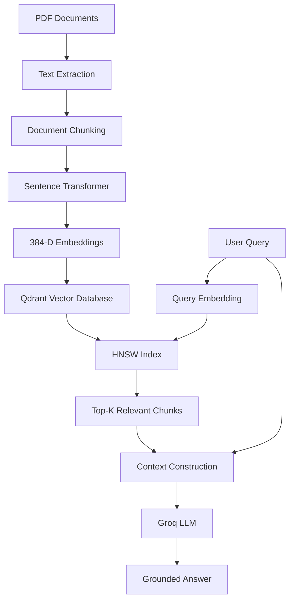

---

## RAG Pipeline

### 1. Document Ingestion

PDF documents are read and converted into text.

The extracted text is divided into smaller chunks.

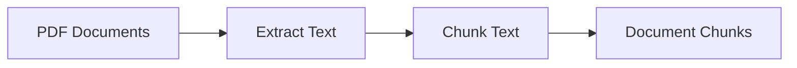

Current dataset:

- **2 PDF documents**
- **311 total chunks**

```text
hnsw.pdf
70,414 characters
157 chunks

rag.pdf
69,077 characters
154 chunks

Total
311 chunks
```

### 2. Embedding Generation

Each document chunk is converted into a numerical vector using:

```text
sentence-transformers/all-MiniLM-L6-v2
```

The model produces:

```text
384-dimensional embeddings
```

Conceptually:

```text
Document Chunk
      |
      v
Sentence Transformer
      |
      v
[0.124, -0.382, 0.721, ..., 0.091]
```

The embedding represents the semantic meaning of the text.

### 3. Vector Storage

The generated embeddings are stored in **Qdrant**.

Current configuration:

```text
Collection: rag_documents
Distance: COSINE
Vector Dimension: 384
HNSW M: 16
ef_construct: 100
```

Each vector is stored together with metadata:

```text
{
    "text": "...document chunk...",
    "source": "hnsw.pdf"
}
```

---

## HNSW

### What is HNSW?

**HNSW** stands for:

> Hierarchical Navigable Small World

HNSW is a graph-based **Approximate Nearest Neighbor (ANN)** algorithm used to efficiently search high-dimensional vector spaces.

In traditional exact vector search, the query vector can be compared against every vector in the database.

```text
Query
 |
 +-- Vector 1
 +-- Vector 2
 +-- Vector 3
 +-- Vector 4
 +-- ...
 +-- Vector N
```

HNSW instead organizes vectors into a graph and navigates through the graph toward promising candidates.


---

## How HNSW Works

HNSW builds a hierarchy of graphs.

Higher layers contain fewer nodes and provide fast long-distance navigation.

Lower layers contain more nodes and allow increasingly detailed search.

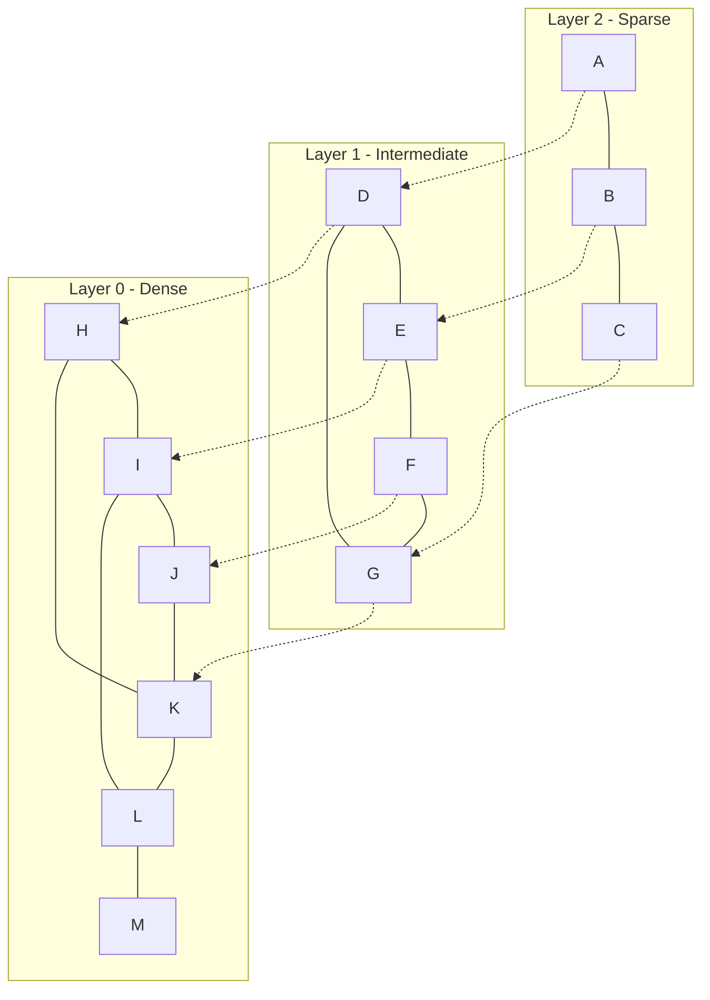

Conceptually:

```text
Higher Layer
     |
     | Fast navigation
     v
Middle Layer
     |
     | More detailed navigation
     v
Layer 0
     |
     | Fine-grained search
     v
Nearest Neighbors
```

---

## HNSW Search Process

When a query arrives, HNSW does not search every vector.

Instead, it starts from an entry point and navigates through the graph.

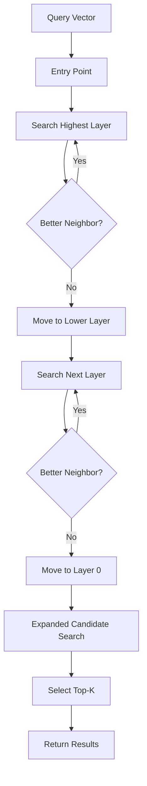

The search can be summarized as:

1. Select an entry point.
2. Start at the highest HNSW layer.
3. Move toward nodes closer to the query.
4. When no better neighbor is found, descend to the next layer.
5. Repeat the process.
6. At Layer 0, perform a more extensive candidate search.
7. Return the nearest `K` vectors.

---

## HNSW Parameters

The Qdrant collection is configured using:

```python
HnswConfigDiff(
    m=16,
    ef_construct=100,
)
```

The important HNSW parameters are:

- `M`
- `ef_construct`
- `ef`

### M

`M` controls the number of connections maintained by each node in the HNSW graph.

A higher `M` generally produces a more connected graph.

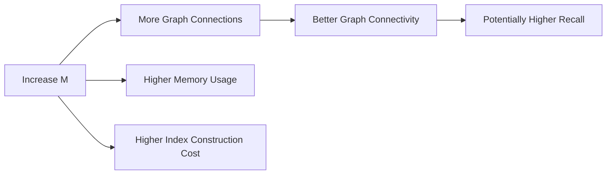

The project uses:

```text
M = 16
```

### ef_construct

`ef_construct` controls the number of candidate nodes considered while constructing the HNSW index.

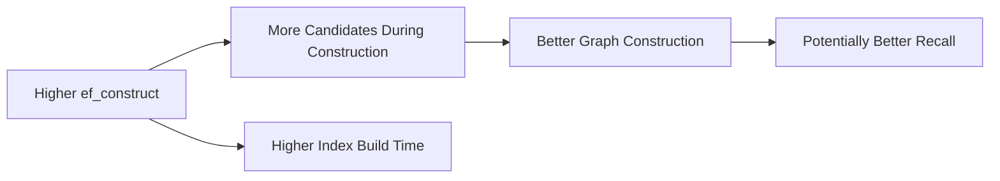

The project uses:

```text
ef_construct = 100
```

`ef_construct` primarily affects **index construction** rather than the search cost of an individual query.

### ef

`ef` is a **search-time parameter**.

It controls how many candidate nodes HNSW considers while processing a query.

```text
Lower ef
   |
   +--> Fewer candidates
   +--> Faster search
   +--> Potentially lower recall

Higher ef
   |
   +--> More candidates
   +--> More computation
   +--> Slower search
   +--> Potentially higher recall
```

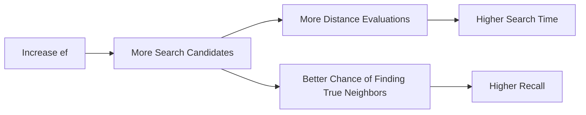

Therefore, `ef` provides an important **speed-versus-recall trade-off**.

---

## Exact Search vs HNSW

Exact vector search compares the query against all vectors.

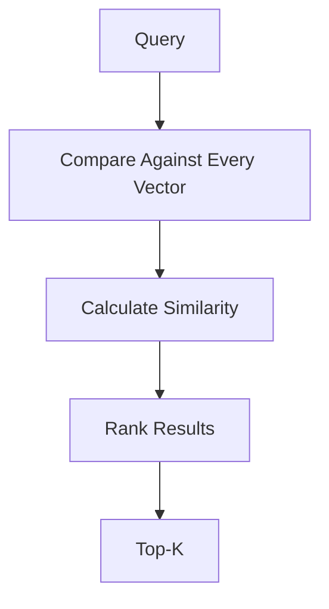

HNSW avoids exhaustive comparison by navigating through the graph.

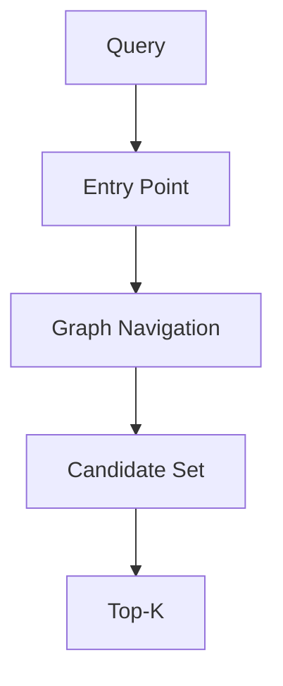

| Feature | Exact Search | HNSW |
|---|---|---|
| Search type | Exact | Approximate |
| Vectors examined | Potentially all | Subset |
| Search speed | Slower at scale | Faster at scale |
| Recall | Exact | Approximate |
| Index required | No ANN index | HNSW graph |
| Scalability | Limited for very large datasets | Designed for large-scale ANN |

---

## Technology Stack

| Technology | Purpose |
|---|---|
| Python | Core implementation |
| Sentence Transformers | Semantic embeddings |
| all-MiniLM-L6-v2 | Embedding model |
| Qdrant | Vector database |
| HNSW | Approximate nearest-neighbor indexing |
| Groq | LLM inference |
| PyPDF | PDF text extraction |
| NumPy | Vector operations |
| python-dotenv | Environment configuration |

---

## Project Structure

```text
advanced-rag/
│
├── app/
│   ├── ingestion.py
│   ├── embeddings.py
│   ├── vector_store.py
│   ├── retrieval.py
│   ├── generator.py
│   └── benchmark.py
│
├── data/
│   └── documents/
│       ├── hnsw.pdf
│       └── rag.pdf
│
├── qdrant_data/
│
├── .env
├── .gitignore
├── requirements.txt
└── README.md
```

---

## Implementation Workflow

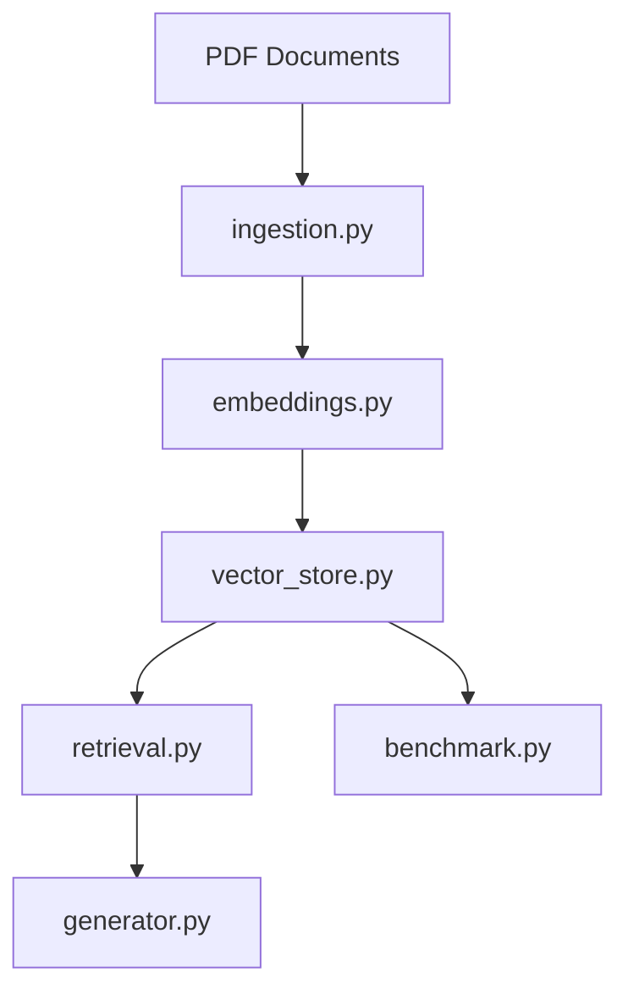

### Step 1 — Ingest Documents

```bash
python app/ingestion.py
```

This extracts text from PDF files and splits it into chunks.

### Step 2 — Generate Embeddings

```bash
python app/embeddings.py
```

This loads the Sentence Transformer model and generates 384-dimensional embeddings.

### Step 3 — Build Qdrant Vector Store

```bash
python app/vector_store.py
```

This:

1. Creates the Qdrant collection.
2. Configures cosine similarity.
3. Configures HNSW.
4. Inserts the embeddings.
5. Stores document metadata.

### Step 4 — Test Retrieval

```bash
python app/retrieval.py
```

The retrieval module converts the query into an embedding and searches Qdrant using HNSW.

### Step 5 — Generate RAG Answer

```bash
python app/generator.py
```

The system:

1. Accepts the user's question.
2. Generates a query embedding.
3. Retrieves relevant chunks.
4. Builds the context.
5. Sends the query and context to the Groq LLM.
6. Generates a grounded response.

Example:

```text
Enter your question: What is HNSW?

============================================================
ANSWER
============================================================

HNSW stands for Hierarchical Navigable Small World...
```

---

## Installation

### Clone the Repository

```bash
git clone <repository-url>
cd advanced-rag
```

### Create a Virtual Environment

```bash
python -m venv venv
```

Activate it on Windows:

```bash
venv\Scripts\activate
```

### Install Dependencies

```bash
pip install -r requirements.txt
```

---

## Configuration

Create a `.env` file in the project root:

```env
GROQ_API_KEY=your_groq_api_key
```

Never commit API keys to Git.

Add the following to `.gitignore`:

```text
.env
venv/
__pycache__/
qdrant_data/
```

---

## Running the Project

Run the components in the following order:

### 1. Ingest Documents

```bash
python app/ingestion.py
```

### 2. Generate Embeddings

```bash
python app/embeddings.py
```

### 3. Create Vector Store

```bash
python app/vector_store.py
```

### 4. Run the RAG System

```bash
python app/generator.py
```

---

## Benchmarking

A major component of this project is evaluating **HNSW against exact vector search**.

For each query, the benchmark records:

- Exact search latency
- HNSW search latency
- Exact nearest-neighbor IDs
- HNSW nearest-neighbor IDs
- Recall@K

The benchmark therefore evaluates both:

```text
Performance
     +
Retrieval Quality
```

---

## Evaluation Metrics

### Search Latency

Search latency measures how long retrieval takes.

Lower latency indicates faster retrieval.

### Recall@K

Recall@K measures how many of the true top-K results found by exact search are also retrieved by HNSW.

```text
Recall@K =
Number of exact top-K results retrieved by HNSW
------------------------------------------------
K
```

For example:

```text
Exact:
{1, 2, 3, 4, 5}

HNSW:
{1, 2, 3, 4, 5}

Recall@5 = 5 / 5 = 100%
```

If HNSW returns:

```text
{1, 2, 3, 7, 8}
```

then:

```text
Recall@5 = 3 / 5 = 60%
```

Exact search is treated as the reference for this experiment.

---

## Experimental Results

Current dataset:

```text
Total vectors: 311
Vector dimension: 384
```

Benchmark results:

| Query | Exact Search | HNSW Search | Recall@5 |
|---|---:|---:|---:|
| What is HNSW? | 5.1691 ms | 4.8487 ms | 100% |
| How does HNSW search work? | 1.2633 ms | 0.9692 ms | 100% |
| What is approximate nearest neighbor search? | 3.4653 ms | 0.9223 ms | 100% |
| What is retrieval augmented generation? | 2.3396 ms | 0.8944 ms | 100% |
| How are HNSW layers constructed? | 3.8957 ms | 1.5539 ms | 100% |

### Observations

For the current dataset:

- HNSW achieved **100% Recall@5** across all tested queries.
- HNSW was faster than exact search for all five queries.
- The largest observed latency improvement occurred for:
  `What is approximate nearest neighbor search?`
- The dataset contains only 311 vectors, so these results should **not** be interpreted as a large-scale production benchmark.

The experiment primarily demonstrates the HNSW mechanism and its speed-versus-recall trade-off.

---

## HNSW in the RAG Pipeline

HNSW is useful in RAG systems because the retrieval stage can become a bottleneck as the number of document chunks increases.

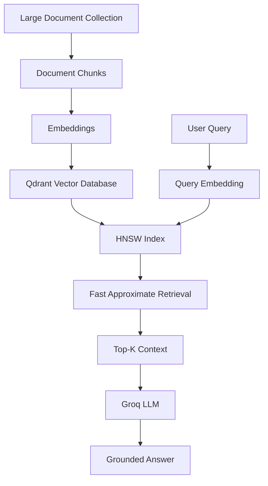

For a small dataset, exact search can be sufficient.

As the vector collection grows, ANN techniques such as HNSW can reduce the amount of computation required during retrieval.

---

## Limitations

### Small Dataset

The current experiment contains only:

```text
311 vectors
```

HNSW's advantages become more significant as the dataset grows.

Therefore, the current latency measurements should not be interpreted as production-scale performance.

### Limited Evaluation Queries

Only a small number of representative queries are currently used.

A larger evaluation dataset would provide more statistically meaningful results.

### Chunking Strategy

The current chunking strategy can be improved using:

- Semantic chunking
- Recursive chunking
- Section-aware chunking
- Overlapping chunks
- Metadata-aware chunking

### Retrieval Evaluation

The current evaluation focuses primarily on Recall@K.

Additional metrics would provide a more comprehensive evaluation.

---

## Future Improvements

### 1. Larger Dataset

Evaluate the system with thousands or millions of vectors.

### 2. HNSW Parameter Tuning

Perform systematic experiments over:

```text
M
ef_construct
ef
```

and analyze:

```text
Latency vs Recall
```

### 3. Hybrid Search

Combine semantic vector search with keyword-based retrieval.

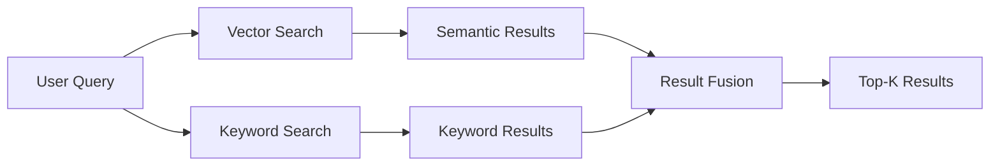

### 4. Reranking

Use a cross-encoder or reranker after initial retrieval.

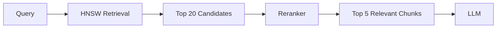

### 5. Better Evaluation

Future evaluation can include:

- Recall@K
- Precision@K
- MRR
- NDCG
- Answer relevance
- Faithfulness
- Retrieval latency
- End-to-end latency

### 6. Production Deployment

The local Qdrant instance can be replaced with a production Qdrant deployment, and the application can be containerized using Docker.

---

## Conclusion

This project demonstrates an end-to-end **advanced RAG architecture** with a focus on efficient vector retrieval.

The complete pipeline is:

```text
PDF Documents
      ↓
Text Extraction
      ↓
Chunking
      ↓
Sentence Transformers
      ↓
Vector Embeddings
      ↓
Qdrant
      ↓
HNSW Index
      ↓
Top-K Retrieval
      ↓
Context Construction
      ↓
Groq LLM
      ↓
Grounded Answer
```

The project demonstrates that HNSW is an important **Approximate Nearest Neighbor indexing technique** for efficient vector retrieval.

It also experimentally evaluates the trade-off between retrieval speed and accuracy using:

- Exact vector search
- HNSW search
- Search latency
- Recall@K
- HNSW parameters such as `M`, `ef_construct`, and `ef`

---

## Author

**Shreya Reddy**

Computer Science Undergraduate  
Keshav Memorial Institute of Technology
